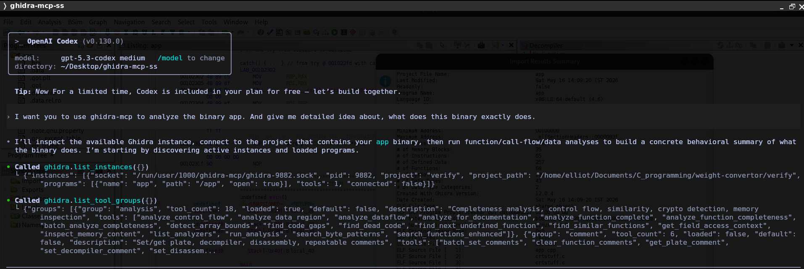
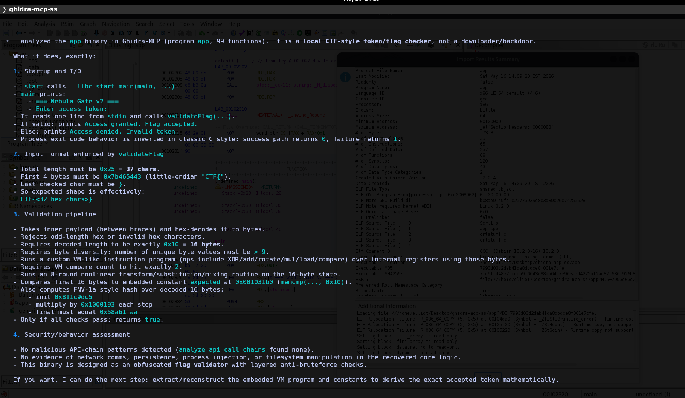

# 🔬 GhidraMCP + OpenAI Codex CLI

> **Query a live Ghidra session in plain English from your terminal — decompile functions, detect malware behaviors, extract IOCs, and crack binaries without touching the GUI.**

This repository documents the complete setup of **GhidraMCP** with **OpenAI Codex CLI** on Kali Linux, and includes a real worked example reversing a CTF-style crackme binary using only natural language prompts.

---

## 📺 What This Looks Like in Practice

**Prompt Codex to analyze an unknown binary:**



**Codex chains Ghidra API calls and returns a full analysis:**



---

## 🧠 Why This Setup Exists

Reverse engineering manually is slow. Reading raw pseudocode, mapping control flow, hunting strings, and identifying malware patterns across a binary can consume hours — even for experienced analysts.

This setup collapses that workflow. You ask questions in plain English. Codex talks to GhidraMCP under the hood, chains the right API calls, and returns structured findings.

**Before:** Open Ghidra → navigate to function → decompile → read pseudocode → manually correlate strings → repeat for every function.

**After:** One prompt. Codex handles the rest.

---

## 🗂️ Documentation

| File | Contents |
|------|----------|
| [`docs/overview.md`](docs/overview.md) | Architecture, how components connect, full benefit breakdown |
| [`docs/setup.md`](docs/setup.md) | Step-by-step installation on Kali Linux |
| [`docs/example-analysis.md`](docs/example-analysis.md) | Real crackme reverse-engineered via Codex + GhidraMCP |
| [`docs/usage.md`](docs/usage.md) | Starter prompts and multi-turn workflows |
| [`docs/troubleshooting.md`](docs/troubleshooting.md) | Common failures and exact fixes |

---

## ⚡ Architecture

```
OpenAI Codex CLI           ← your terminal AI agent (GPT-4/5)
        │
        │  stdio + MCP JSON-RPC
        ▼
bridge_mcp_ghidra.py       ← Python MCP server (wrapper script)
        │
        │  Unix Domain Socket (UDS)
        ▼
GhidraMCP Plugin           ← installed inside Ghidra
        │
        ▼
Your Binary                ← whatever you're analyzing
```

> This setup uses **UDS** (not HTTP) between bridge and Ghidra, and **stdio** (not a URL) between Codex and the bridge. This is the working configuration on Kali Linux.

---

## 🧰 Prerequisites

| Tool | Version | Purpose |
|------|---------|---------|
| Kali Linux | Any recent | Host OS (VMware confirmed working) |
| Ghidra | 11.x+ | Disassembler / decompiler backend |
| Java | 21+ | Required by Ghidra |
| Python | 3.10+ | Runs the MCP bridge |
| Node.js + npm | 18+ | Runs Codex CLI |
| OpenAI account | ChatGPT Plus/Pro | Powers the AI |
| GhidraMCP | 5.2+ | Ghidra plugin + bridge |

---

## 🚀 Quick Start

→ **[Full Setup Guide — docs/setup.md](docs/setup.md)**

---

## 🔍 Worked Example

→ **[Crackme Reverse Engineering — docs/example-analysis.md](docs/example-analysis.md)**

Walks through reversing `app` (a CTF-style crackme with a VM checker, 8-round SPN, and FNV-1a hash gate) using Ghidra + Codex with no manual decompiler navigation.

---

## 📄 License

MIT — use freely, contribute back.

## 🙏 Credits

- [bethington/ghidra-mcp](https://github.com/bethington/ghidra-mcp) — GhidraMCP plugin and Python bridge
- [OpenAI Codex CLI](https://github.com/openai/codex) — terminal AI agent
