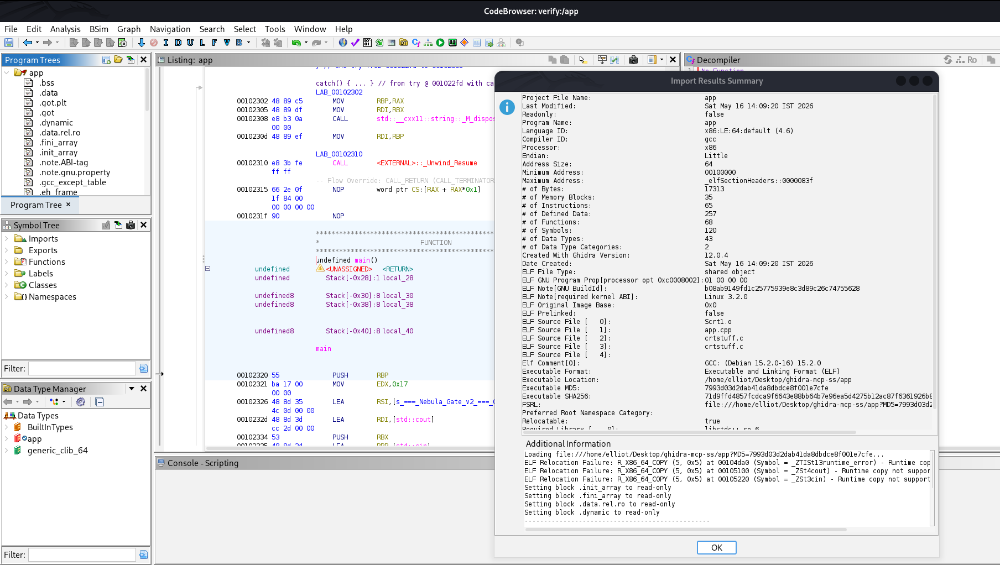

# Overview — GhidraMCP + OpenAI Codex CLI

## What Is This?

This setup connects **OpenAI Codex CLI** to a live **Ghidra** session via **GhidraMCP** — a plugin and Python bridge that exposes Ghidra's full analysis engine as MCP (Model Context Protocol) tools.

The result: you talk to Ghidra in plain English from your terminal. Codex issues structured API calls to read, decompile, annotate, and reason about your binary in real time.

---

## How the Components Connect

```
┌─────────────────────────────────────────┐
│            Your Terminal                │
│                                         │
│   $ codex                               │
│   > "Detect malware behaviors and       │
│      extract all IOCs."                 │
└───────────────┬─────────────────────────┘
                │
                │  stdio + MCP JSON-RPC
                ▼
┌─────────────────────────────────────────┐
│         bridge_mcp_ghidra.py            │
│         (Python MCP Server)             │
│                                         │
│  Registers 150+ tools to Codex          │
└───────────────┬─────────────────────────┘
                │
                │  Unix Domain Socket (UDS)
                ▼
┌─────────────────────────────────────────┐
│         GhidraMCP Plugin                │
│         (Running inside Ghidra)         │
└───────────────┬─────────────────────────┘
                │
                │  Ghidra Program API
                ▼
┌─────────────────────────────────────────┐
│         Your Binary in CodeBrowser      │
└─────────────────────────────────────────┘
```

**Key implementation detail:** The bridge connects via **UDS** (Unix Domain Socket), not HTTP/TCP. Codex connects to the bridge via **stdio**, not a URL. Both of these differ from many other guides.

---

## The Ghidra Interface

Once Ghidra is open with your binary loaded and GhidraMCP running, you'll see something like this:



Codex can query everything visible here — and much more — without you clicking a single button.

---

## Why This Saves Time

### 1. Eliminates Manual Navigation

Every piece of information in standard Ghidra requires UI interaction: opening decompiler windows, scrolling function lists, right-clicking to rename symbols, searching strings one by one. A single Codex prompt can chain 10+ API calls automatically.

**Example:** `"Find the main function, decompile it, and summarize what it does"` triggers `list_entry_points` → `decompile_function` → natural language synthesis. What takes 5–10 minutes of manual work takes ~5 seconds.

---

### 2. Natural Language Function Triage

Instead of reading raw pseudocode function by function:

```
"Find the function responsible for network communication,
decompile it, and explain what protocol it uses."
```

Codex chains `list_functions` → `get_callers` → `decompile_function` and returns a plain-English explanation.

---

### 3. Automated Malware Triage

GhidraMCP exposes dedicated malware-analysis tools:

- `detect_malware_behaviors` — flags anti-debug, process injection, persistence, priv-esc
- `extract_iocs_with_context` — IPs, domains, file paths, registry keys with surrounding code context
- `analyze_control_flow` — maps branching logic for obfuscated binaries

What would take hours of manual pattern-matching can be summarized in a single prompt.

---

### 4. AI-Assisted Renaming

Ghidra auto-names functions like `FUN_00401080`. With Codex:

1. Decompile the function
2. Infer a meaningful name from behavior
3. Call `rename_function` to apply it in the project

A binary with 200 unnamed functions can be partially annotated in minutes.

---

### 5. Persistent Conversational Analysis

Codex maintains context across a session. You can drill down iteratively:

```
> What functions does main call?
> Focus on the one that looks like decryption.
> Is the key hardcoded? Extract it.
> Rename the function to decrypt_payload.
```

Each response builds on the last. It feels like working with a colleague who can read decompiled code instantly.

---

## Benefits Summary

| Benefit | Description |
|---------|-------------|
| **Speed** | Triage a binary in minutes, not hours |
| **Breadth** | Chain multiple Ghidra API calls from one prompt |
| **Readability** | Plain-English explanation of decompiled pseudocode |
| **Automation** | Rename functions, detect patterns, extract IOCs hands-free |
| **Scalability** | Analyze large binaries without manual scrolling |
| **No scripting** | Natural language only — no Python scripts to write |
| **Cloud AI** | GPT-4/5 via Codex — no GPU or local model needed |

---

## What GhidraMCP Exposes (~150+ Tools)

**Program Info:** `get_current_program_info`, `list_entry_points`, `get_architecture_info`

**Functions:** `list_functions`, `decompile_function`, `get_function_by_name`, `rename_function`, `get_callers`, `get_callees`

**Strings & Data:** `list_strings`, `search_strings`, `get_data_at_address`

**Control Flow:** `analyze_control_flow`, `get_basic_blocks`

**Malware Analysis:** `detect_malware_behaviors`, `extract_iocs_with_context`, `find_suspicious_imports`

**Cross-References:** `list_imports`, `list_exports`, `get_xrefs_to`, `get_xrefs_from`, `rename_variable`

**Memory:** `list_memory_segments`, `get_bytes_at_address`

> If Codex shows only a handful of tools at `/mcp`, GhidraMCP isn't connected. See [`troubleshooting.md`](troubleshooting.md).
