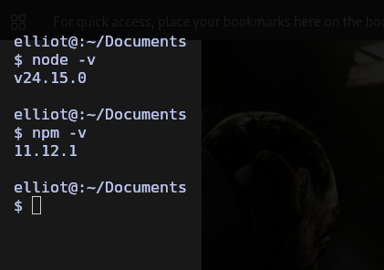
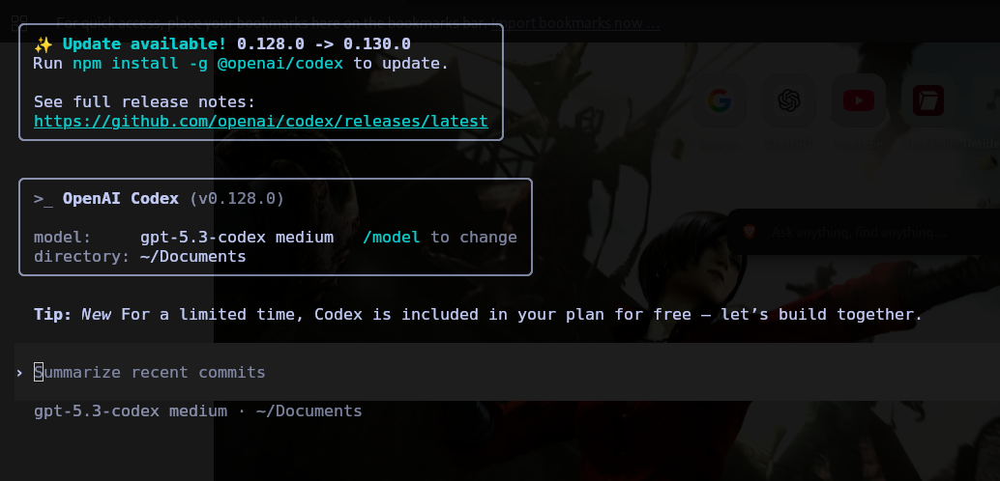
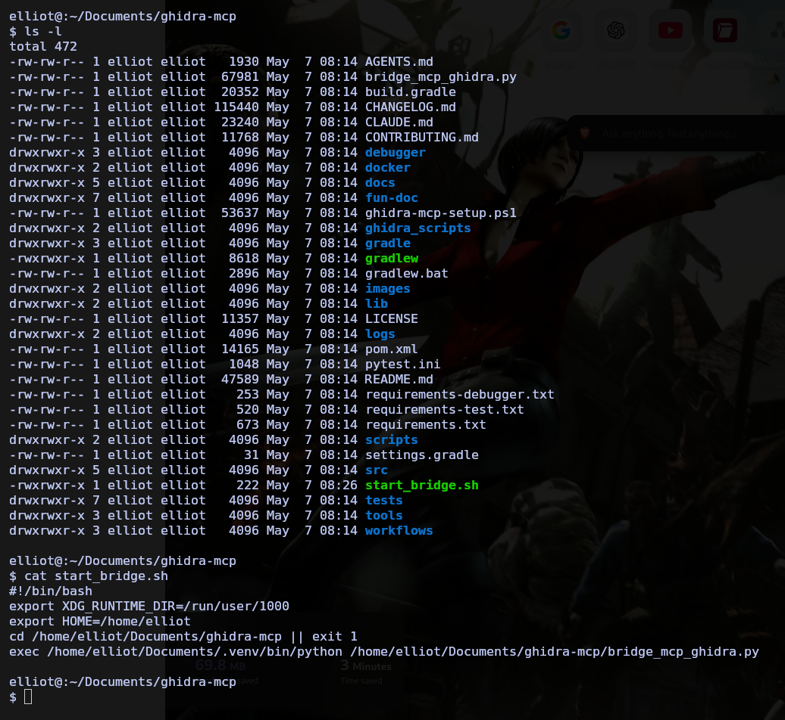
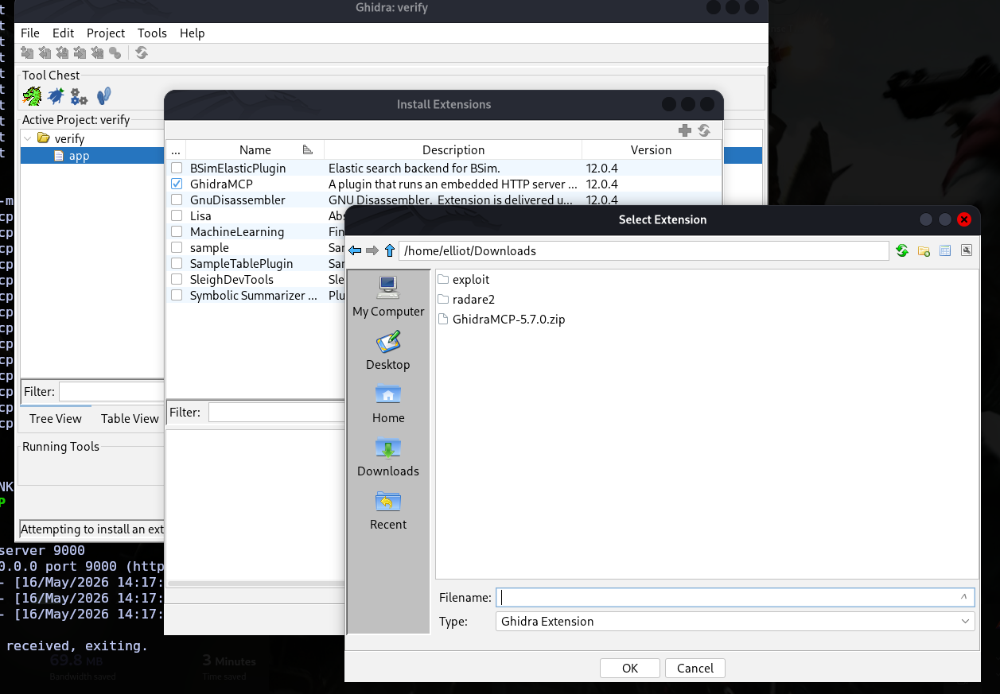
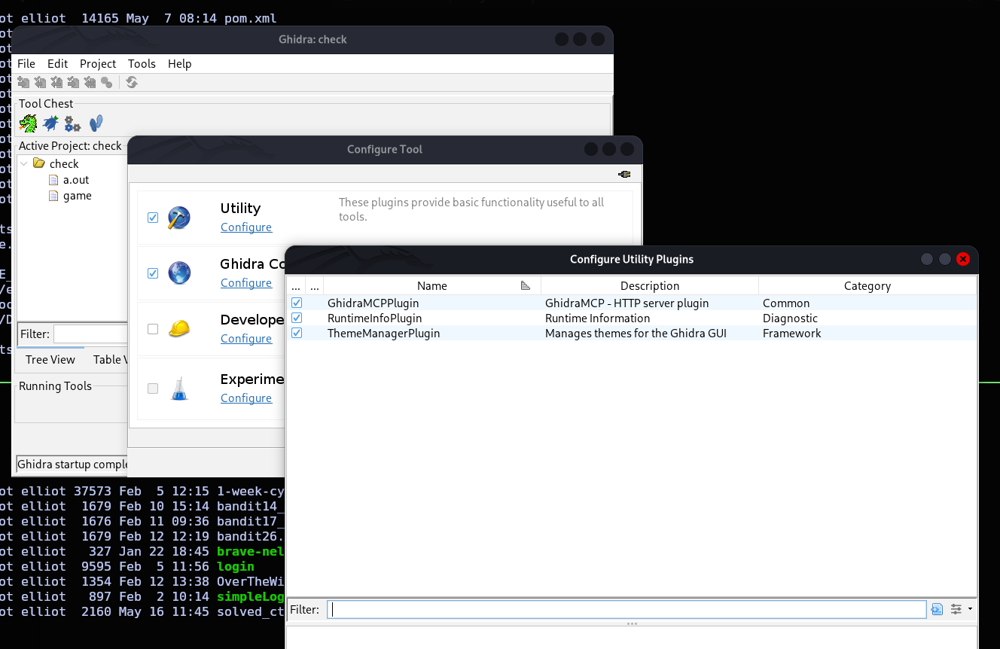
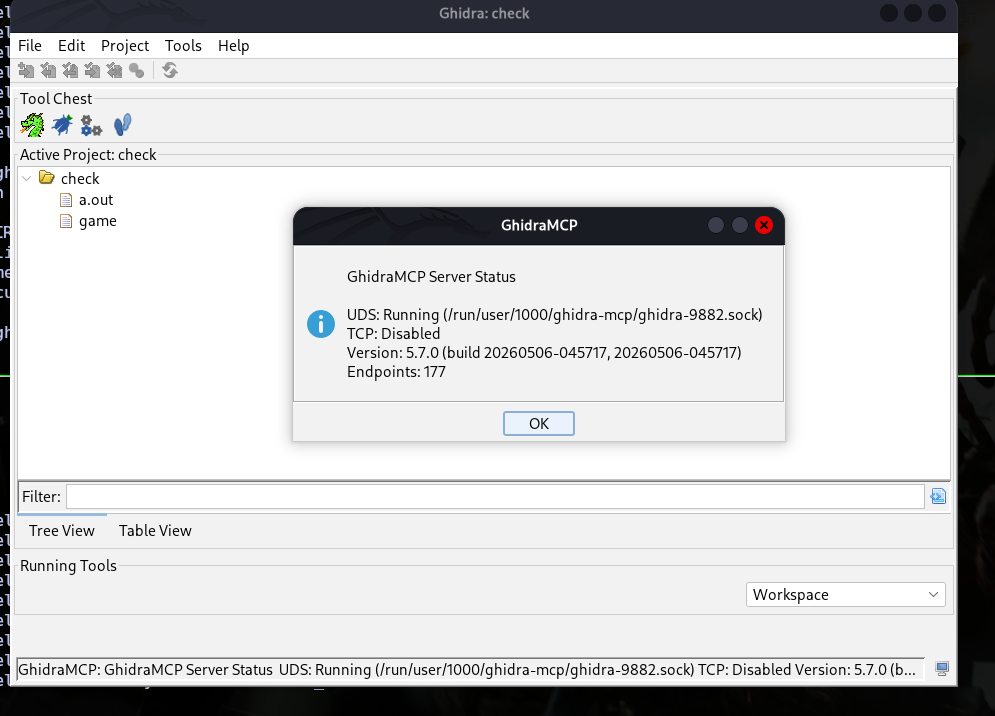
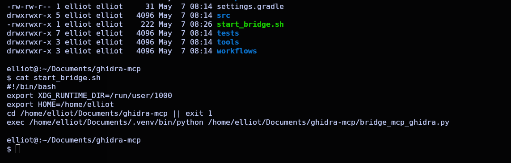
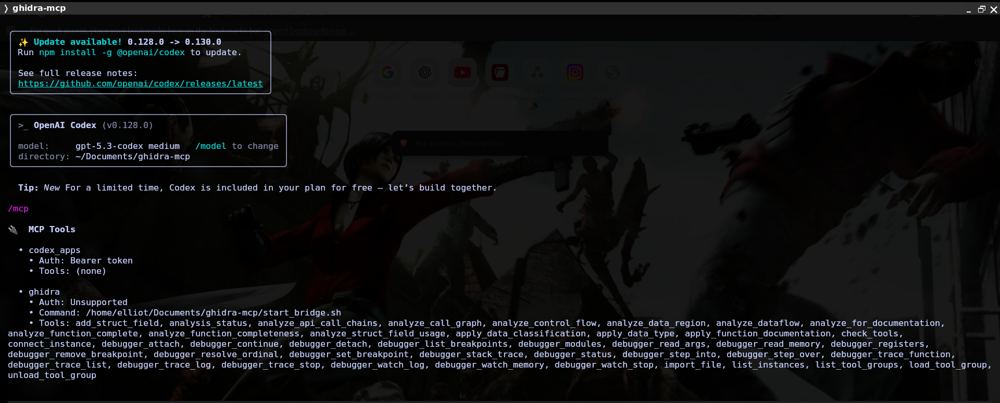

# Setup Guide — GhidraMCP + OpenAI Codex CLI on Kali Linux

> Tested on: **Kali Linux** (VMware), Ghidra 11.x, GhidraMCP 5.2+, Codex CLI 0.121.0
> Connection: **stdio bridge + UDS** (not HTTP, not TCP)

---

## Part 1 — Install OpenAI Codex CLI

### 1.1 Check for Node.js and npm

```bash
node -v
npm -v
```

If either is missing:

```bash
sudo apt update
sudo apt install -y npm
```



### 1.2 Install Codex globally

```bash
cd ~
sudo npm i -g @openai/codex
```

### 1.3 Verify the install

```bash
codex --version
```

Expected: `codex-cli 0.121.0` (or newer)

### 1.4 Launch Codex once to authenticate

```bash
codex
```

Sign in with your OpenAI account when prompted. Exit with `Ctrl + C` once done.



---

## Part 2 — Get the GhidraMCP Repo and Python Bridge

### 2.1 Clone the repository

```bash
cd ~/malware_lab
git clone https://github.com/bethington/ghidra-mcp.git
cd ghidra-mcp
```

> Adjust the parent directory to wherever you keep your analysis work.

### 2.2 Create a Python virtual environment

```bash
python3 -m venv .venv
source .venv/bin/activate
```

Your prompt should now show `(.venv)` as a prefix.

### 2.3 Install bridge dependencies

```bash
pip install -r requirements.txt
```

### 2.4 Confirm key files are present

```bash
ls
```

You need to see `bridge_mcp_ghidra.py` and `requirements.txt`.



---

## Part 3 — Install GhidraMCP Inside Ghidra

### 3.1 Download the GhidraMCP extension ZIP

Go to the [bethington/ghidra-mcp Releases page](https://github.com/bethington/ghidra-mcp/releases) and download the latest ZIP (e.g. `GhidraMCP-5.3.2.zip`).

Do **not** extract it — Ghidra installs from the ZIP directly.

### 3.2 Install via Ghidra's extension manager

1. Open Ghidra
2. Go to **File → Install Extensions**
3. Click the **"+"** button (top right of the dialog)
4. Select the downloaded ZIP
5. Click **OK**
6. **Restart Ghidra** when prompted



### 3.3 Open your project and binary in CodeBrowser

1. Open or create a Ghidra project
2. Import and open your target binary in **CodeBrowser**
3. Let auto-analysis complete

### 3.4 Enable the GhidraMCP plugin

1. In CodeBrowser: **File → Configure**
2. Navigate to the **Utility** section
3. Find **GhidraMCPPlugin** and check the box
4. Click **OK**



### 3.5 Start the GhidraMCP server

Go to **Tools → GhidraMCP → Start Server**

The status panel must show **UDS: Running**. TCP should be disabled.



---

## Part 4 — Verify the Bridge Manually

Before wiring Codex in, confirm the bridge can reach Ghidra on its own.

```bash
cd ~/malware_lab/ghidra-mcp
source .venv/bin/activate
python bridge_mcp_ghidra.py
```

Expected output:

```
Connecting via UDS...
Connected.
Registered 152 tools.
MCP server ready.
```

If this works, stop it with `Ctrl + C`. If it errors, see [`troubleshooting.md`](troubleshooting.md).

---

## Part 5 — Create the Wrapper Script

**This is the step most guides skip.** Codex launches the bridge as a subprocess but doesn't inherit the correct shell environment — so it can't find the venv Python or the UDS socket path.

The fix is a small wrapper script that sets everything up before exec'ing the bridge.

### 5.1 Create the script

```bash
nano ~/malware_lab/ghidra-mcp/start_bridge.sh
```

Paste:

```bash
#!/bin/bash

export XDG_RUNTIME_DIR="/run/user/$(id -u)"
export HOME="/home/kali"

cd /home/kali/malware_lab/ghidra-mcp

exec /home/kali/malware_lab/ghidra-mcp/.venv/bin/python bridge_mcp_ghidra.py
```

> Adjust `/home/kali` and `malware_lab` to match your actual username and directory.

### 5.2 Make it executable

```bash
chmod +x ~/malware_lab/ghidra-mcp/start_bridge.sh
```

### 5.3 Test it directly

```bash
~/malware_lab/ghidra-mcp/start_bridge.sh
```

Should behave identically to Part 4. Stop with `Ctrl + C`.



---

## Part 6 — Register GhidraMCP in Codex

### 6.1 Remove any stale entry

```bash
codex mcp remove ghidra
```

(Safe to run even if no entry exists.)

### 6.2 Add the wrapper as a global MCP server

```bash
codex mcp add ghidra -- /home/kali/malware_lab/ghidra-mcp/start_bridge.sh
```

Expected: `Added global MCP server 'ghidra'.`

### 6.3 Launch Codex and verify

```bash
codex
```

Then at the Codex prompt:

```
/mcp
```

### 6.4 What success looks like

You should see `ghidra` listed with **150+ tools**, including:

- `decompile_function`
- `list_functions`
- `detect_malware_behaviors`
- `extract_iocs_with_context`
- `analyze_control_flow`
- `rename_function` / `rename_variable`



> If you only see a handful of base tools, the bridge isn't connected. See [`troubleshooting.md`](troubleshooting.md).

---

## ✅ Setup Complete

With the full tool list showing, you're ready. Jump to:

- **[Usage Guide](usage.md)** — starter prompts and workflows
- **[Example Analysis](example-analysis.md)** — real crackme reversed with Codex + GhidraMCP
